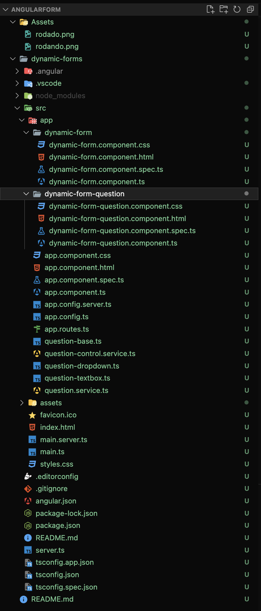
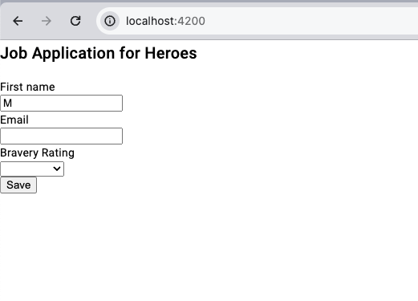
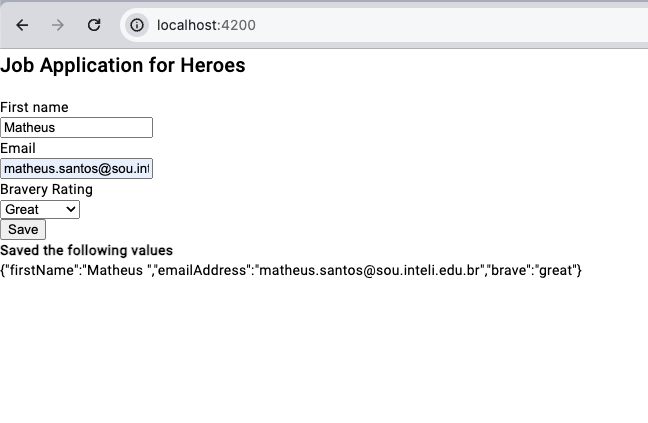

# Relatório do Projeto Angular

## Tecnologia Angular

Angular é um framework de desenvolvimento para construir aplicações web dinâmicas e responsivas. Utiliza TypeScript como linguagem de base, oferecendo ferramentas robustas para desenvolvimento frontend, como data-binding, componentização, injeção de dependência, e uma rica suite de testes.

## Conceitos Aprendidos

- **Componentes**: Blocos de construção básicos que controlam uma parte da tela (view).
- **Módulos**: Conjuntos de funcionalidades relacionadas, incluindo componentes, serviços e diretivas.
- **Data Binding**: Sincronização de dados entre o modelo de dados e a view.
- **Diretivas**: Extensões do HTML para adicionar comportamento às templates.
- **Serviços e Injeção de Dependência**: Para compartilhar lógicas e dados entre componentes.

## Estruturacao do Projeto

## Execução do Projeto

0. **Inicialização**: Através do comando "ng serve" dentro do diretório do projeto.
1. **Tela inicial**: Imagem da aplicação rodando na porta 4200.
   
2. **Após inserção de dados**: Imagem mostrando a aplicação com dados inseridos e o retorno esperado `
{"firstName":"Matheus ","emailAddress":"matheus.santos@sou.inteli.edu.br","brave":"great"}`.
   

Este projeto demonstra a eficiência do Angular na criação de formulários dinâmicos, permitindo a construção de interfaces ricas e interativas de forma ágil e estruturada.
